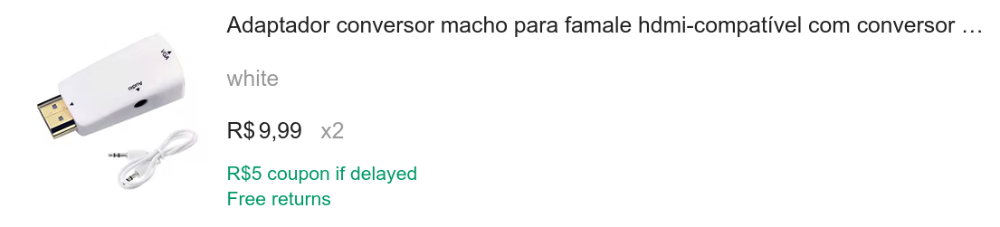

# MSXgoauldSD_tn20k (DirectVideo branch)
MSX Goa'uld board with Tang Nano 20k and SD support


MSX2+ engine in Z80 socket. It turns one MSX into an MSX2+ by replacing Z80 processor. FPGA in board contains: 
* Z80
* V9958 with hdmi output
* MSX2+ BIOS
* SD Card support + Nextor 2.1
* 4MB mapper
* 2MB megaram SCC
* RTC
* PSG
* OPLL
* Kanji Level 1 & 2
* Wifi support using ESP (experimental)

## DirectVideo 240p output

Although the following inexpensive HDMI to VGA adapter is not documented to support 240p/480i input resolutions, there is actually a mode that makes it output a `15 kHz @ 59.9 Hz` sync RGBHV signal, compatible with consumer CRTs.



See [DirectVideo details](fpga/dv.md) to get more information.

## Boards

Old boards V1.4 and V4.1 are compatible with Goa'uld SD. V3 is not supported, owners of V3 should use Goa'uld standard firmware (0.80).

New pcb V1.5 is same as 1.4, optimized for online PCB assembly. See [Assembly guide](/pcba/pcba.md)


## Slot map


Mapper and megaram can be relocated to slots 1 or 2 using config menu.

## Megaram + Sofarun
Megaram is detected automatically by sofarun using default settings. When using other software you may need to indicate location, Slot 3-3 by default.


## Configuration
Config menu is showed pressing 'g' during MSX logo. New improved menu is created by [nataliapc](https://github.com/nataliapc/msx_goauld_settings_menu)


* Enable Mapper: On by default. Disable when having compatibility issues or to use a different mapper
* Enable Megaram: On by default. Disable when having compatibility issues or to use a different megaram
* Enable SD: On by default. Disable when using an external SD mapper
* Mapper Slot: 3 by default. Change to 1 or 2 to get mapper in a not expanded slot. Physical slot will be disabled
* Megaram Slot: 3 by default. Change to 1 or 2 to get megaram in a not expanded slot. Physical slot will be disabled
* Ghost SCC: Off by default. Enable to get sound from an SCC cartridge located in physical slot 1 or 2
* Enable Scanlines: On by default. Disable to get a clean hdmi picture
* Compatible Mode: Off by default. Enable if you experience crashes / unstabilities with external cartridges
* Turbo: Off by default. Enable to use an internal high-speed clock. Recommended for internal SD use only
* Save & Exit: store new config and continue, changes in mapper settings will be effective after pressing reset
* Save & Reset: store new config and make software reset, changes will be immediate

## Known issues
* Reset from config menu is not compatible with some hardware. Use physical reset button when possible
* Tape games fail: use poke -1,0
* Carnivore C2+ and Megaflashrom SCC+ SD are not compatible with Compatible mode (yes, I know)
* Wondertang is not compatible with Turbo mode
* Wifi unreliable: place ESP at appropiate distance from Tang


## Flashing
Programming is done in two steps:
* Flash firmware Z80_goauld.fs  


* Flash bios pack. Set Operation = "exFlash C Bin Erase, Program thru GAO-Bridge" and Start Address = 0x200000  


> [!WARNING]
> Not yet fully working on all MSX!
>

## Build instructions

```
export LD_PRELOAD=$(LIBFONT_CONFIG)
gw_sh build.tcl
```

## Flash Instructions

```
sudo openFPGALoader -b tangnano20k -f --verify impl/pnr/project.fs
```